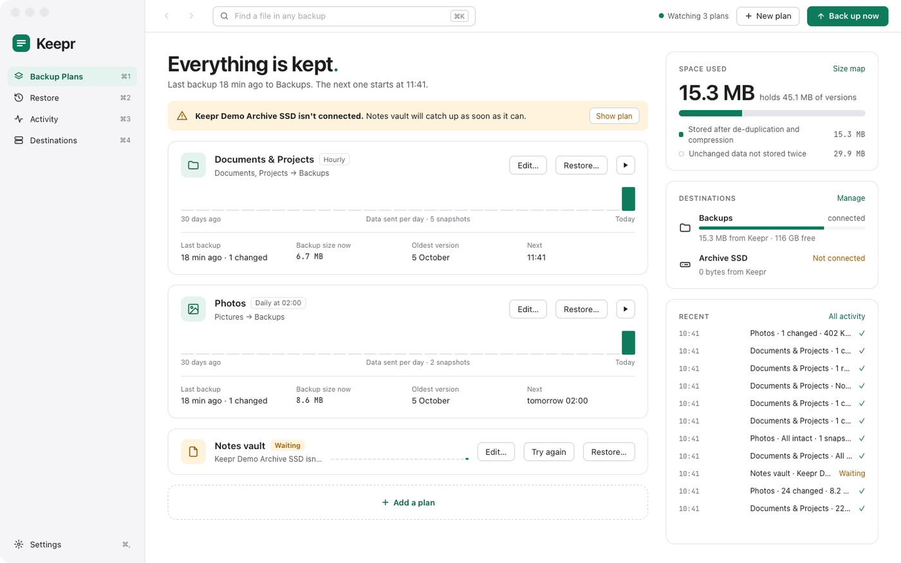

# Keepr

Backups for your Mac. Every file. Every version. Kept.

Keepr keeps every version of the files you choose, on a drive, a NAS, a cloud folder or an S3 bucket, and lets you go back to any moment and restore any file as it was then. The first backup copies everything; after that each one stores only what changed, and every snapshot still restores as a complete copy. Backups can be encrypted, so the place that holds them can't read them.

## Download

For a Mac with Apple silicon (M1 or later) and macOS 13 or later.

1. Download [Keepr.dmg](https://github.com/waynetd777/keepr/releases/latest/download/Keepr.dmg) from the [latest release](https://github.com/waynetd777/keepr/releases/latest).
2. Open it and drag **Keepr** onto **Applications**.
3. Open Keepr from Applications. macOS says it can't check the app for malicious software, because it isn't notarised by Apple. Click **Done**.
4. Open System Settings › Privacy & Security, scroll down and click **Open Anyway** beside Keepr, then **Open Anyway** again and enter your password.
5. In the same place, under **Full Disk Access**, turn Keepr on, so it can back up every folder.

It opens normally after that. The first time you use some features, macOS asks for permission: see [First run](docs/features.md#first-run).

<a href="docs/images/index.md#the-readme"><picture><source media="(prefers-color-scheme: dark)" srcset="docs/images/overview-dark.png"></picture></a>

## What it does

- **Backup plans.** Folders on the Mac, a drive, an SMB share, a cloud folder or an S3 bucket, backed up every 15 minutes, hourly, daily, weekly or when you ask. Rules and `.gitignore` files leave things out. [Backup plans](docs/plans.md)
- **Every version.** Every backup is a complete snapshot, kept by rules you set: every backup for a day, one a day for a month, one a week for a year, one a month for ever. Deleted files are kept for at least 90 days.
- **Only what changed.** Files are split by their content and each piece is stored once, compressed, however many files and snapshots share it. A still copy of the disk means files that change mid-backup are copied as they were at one moment.
- **Encryption.** A password and a recovery key; the destination sees only encrypted data.
- **Restore.** Step back through the snapshots, see every version of a file, Quick Look it or compare it with the file on the Mac, and restore to where it was or somewhere else. Right-click a file for the same and more, or show it in Finder. A size map shows what takes the space, in one snapshot or across every plan. Find a file in every backup at once. [Restore](docs/restore.md)
- **Destinations.** Folders and drives, NAS shares, iCloud Drive, OneDrive and other cloud folders, Amazon S3, Backblaze B2, Cloudflare R2 and other S3 services, with helpers that make the bucket and a key that can only use it. [Destinations](docs/destinations.md)
- **In the menu bar.** Keepr keeps backing up with the window closed, waits for drives, batteries and hotspots, catches up after sleep, checks the backups can be read back, and tells you when something goes wrong. [Day to day](docs/day-to-day.md)

The same guides are in the app's Help menu (⌘?).

## Licence

Keepr is free software under the [GNU General Public License](LICENSE), version 3 or later: you may use, share and change it, and anything you pass on must stay free under the same licence. See [Licence and credits](docs/features.md#licence-and-credits).

## Building it

Needs Rust, Node.js, pandoc (`brew install pandoc`) and Xcode's command-line tools.

```sh
npm install
make dev          # run it with hot reload
make install-app  # build it and put it in /Applications
```

[Development](docs/development.md) has the rest: signing, the release DMG, the command line, screenshots and where things live.
