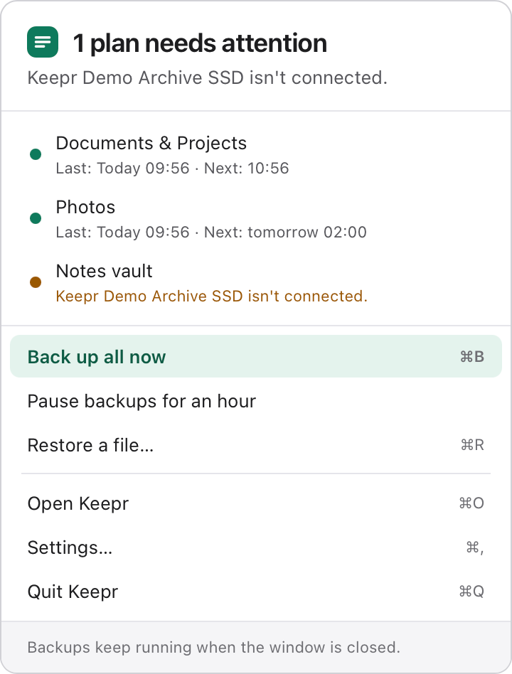
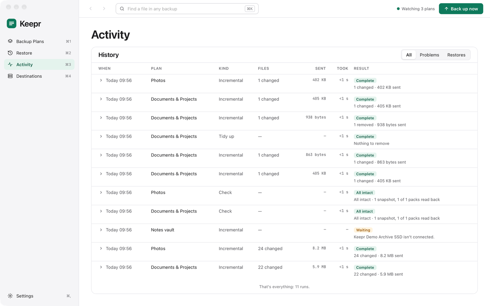
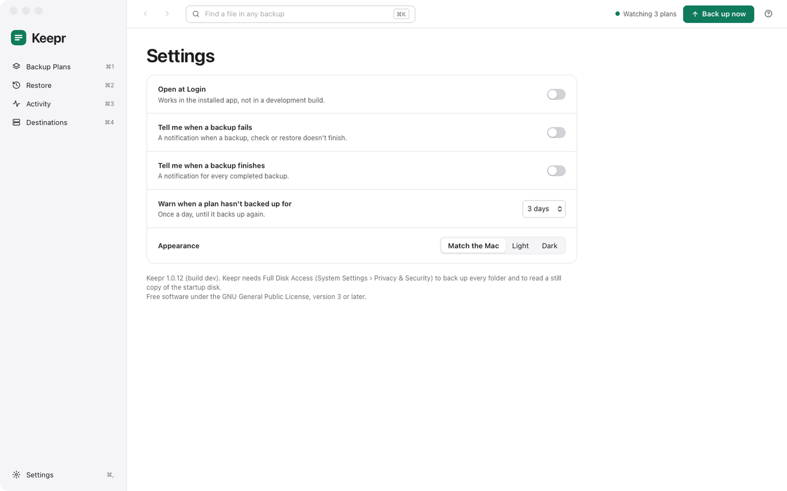

# Day to day

Once your plans are set up, Keepr backs up on its own from the menu bar, whether or not its window is open. This page is about keeping an eye on it: the menu bar, Activity, notifications and Settings, and what Keepr does in the background.

[The menu bar](#the-menu-bar) · [Activity](#activity) · [Notifications](#notifications) · [Settings](#settings) · [In the background](#in-the-background) · [How backups are stored](#how-backups-are-stored)

## The menu bar

<a href="images/index.md#day-to-day"><picture><source media="(prefers-color-scheme: dark)" srcset="images/menu-bar-dark.png"></picture></a>

Keepr's icon in the menu bar shows a dot while it's backing up, and a mark when a plan needs attention. Click it for:

- Whether everything is kept, and what needs attention if not.
- The backup that's running, with its progress and the time left.
- Each plan's last and next backup, or its problem. Click one to open Keepr.
- **Back up all now** (⌘B), **Pause backups for an hour** (which also stops the backup that's running), **Restore a file…** (⌘R), **Open Keepr** (⌘O), **Settings…** (⌘,) and **Quit Keepr** (⌘Q).

## Activity

Activity (⌘3) shows the backup that's running, step by step: looking for changes, comparing, packing (splitting, skipping what's already kept, compressing and encrypting), sending, and confirming. It has the progress, the speed and the time left, how much was already stored and skipped against how much is new, and **Pause** and **Stop**.

If the Mac sleeps or the destination drops off, the next backup picks up the work. Nothing half-sent counts as a snapshot, and **Stop** waits for the file it's on.

<a href="images/index.md#day-to-day"><picture><source media="(prefers-color-scheme: dark)" srcset="images/activity-dark.png"></picture></a>

Below it is the **History** of every backup, full re-read, check, tidy-up and restore, with when it ran, how many files and how much data, how long it took and its result. **All**, **Problems** and **Restores** filter it. Click a row for its log, which says what was backed up, skipped or couldn't be read.

## Notifications

- **Tell me when a backup fails** (on unless you turn it off): a backup, check or restore that didn't finish.
- **Tell me when a backup finishes** (off unless you turn it on).
- **Warn when a plan hasn't backed up for** 1 to 14 days (3 unless you change it): once a day until it backs up. Plans that back up only when you ask aren't warned about.

A check that finds a problem with the stored data always tells you.

## Settings

<a href="images/index.md#day-to-day"><picture><source media="(prefers-color-scheme: dark)" srcset="images/settings-dark.png"></picture></a>

- **Open at Login** starts Keepr when you log in, in the menu bar with no window. It's the same setting as System Settings › General › Login Items.
- The [notifications](#notifications) above.
- **Appearance**: **Match the Mac**, **Light** or **Dark**.

The foot of Settings shows Keepr's version and build, and its licence.

## In the background

- **One job at a time.** Backups, restores, checks and tidy-ups queue up and run one after another.
- **Waiting.** A backup that's due waits while its destination isn't connected, the battery is low, or the Mac is on a hotspot (as the plan says), and tries again every few minutes.
- **Tidying up.** After a backup, at most once a day, Keepr thins out old snapshots by the plan's [Versions to keep](plans.md#versions-to-keep), and frees the space nothing uses any more.
- **Still copies.** For folders on the Mac's own disk, Keepr takes a still copy of the disk (an APFS snapshot, as Time Machine does) and backs up from that, so files that change during the backup are copied as they were at one moment. The copy is deleted afterwards. Time Machine's own snapshots are never touched. Drives, shares, cloud folders and buckets are read as they are.
- **Changes since the last backup.** For folders on the Mac's own disk, Keepr asks macOS which folders have changed since the last backup, and only looks in those. A full re-read looks at everything.

## How backups are stored

Each plan's backup is a folder at its destination, named after the plan, holding packs of data, an index and the snapshots.

- Files are split into pieces by their content, and each piece is stored once, however many files, folders and snapshots have it. A file that moves or is copied costs nothing more.
- Pieces are compressed (zstd), unless they're already compressed.
- An encrypted plan's pieces and snapshots are encrypted with XChaCha20-Poly1305 under a random key, which is itself locked with your password (through Argon2id) and, separately, with the recovery key. That's why changing the password rewrites nothing else.
- A snapshot is written last, after everything it needs, so a backup that's stopped or cut off never leaves a broken snapshot.

Keepr's own settings and history are in `~/Library/Application Support/Keepr`.
