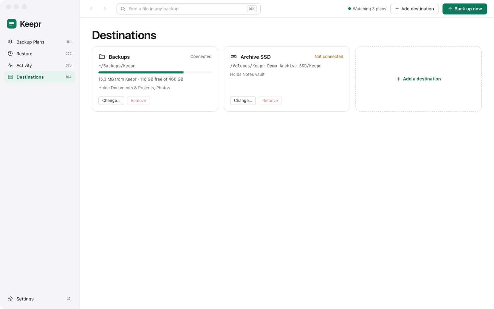
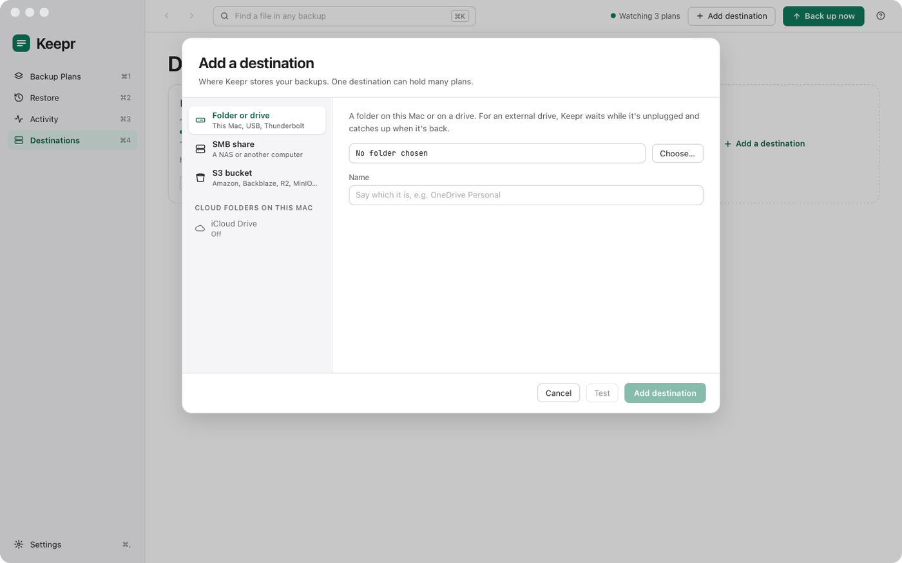

# Destinations

A destination is where Keepr keeps backups: a folder or drive, a share on a NAS, a cloud folder synced to this Mac, or an S3 bucket. One destination can hold many plans, each in its own folder. Add one with **Add a destination** on the Destinations screen (⌘4), or from a plan's **Where**.

<a href="images/index.md#destinations"><picture><source media="(prefers-color-scheme: dark)" srcset="images/destinations-dark.png"></picture></a>

Each destination's card shows whether it's connected, how much Keepr keeps there and how much is free, and which plans it holds. **Change…** edits it; **Remove** is only possible once no plan uses it.

[Adding a destination](#adding-a-destination) · [Folder or drive](#folder-or-drive) · [SMB share](#smb-share) · [Cloud folders on this Mac](#cloud-folders-on-this-mac) · [S3 bucket](#s3-bucket) · [Amazon S3](#amazon-s3) · [Backblaze B2](#backblaze-b2) · [Cloudflare R2](#cloudflare-r2) · [Passwords and keys](#passwords-and-keys)

## Adding a destination

<a href="images/index.md#destinations"><picture><source media="(prefers-color-scheme: dark)" srcset="images/add-destination-dark.png"></picture></a>

Pick the kind of place on the left and fill it in. Keepr suggests a **Name**, which you can change; each destination's name is its own. **Test** writes a small file there, measures the speed and deletes it again: "Connected, and Keepr can write here", with the free space. Then click **Add destination**.

## Folder or drive

A folder on this Mac, or on a USB or Thunderbolt drive. **Choose…** picks it.

When a drive is unplugged, its plans wait, and catch up when it's back. Keepr never writes to a drive's folder while the drive isn't there, so it can't fill the Mac's own disk by mistake.

## SMB share

A share on a NAS or another computer. Keepr lists the servers it finds on your network, and ones you already use; click one, or type its **Server** (`keep-nas.local` or `192.168.1.20`). Then the **Share** (**List** shows them), your **User name** and **Password**, and **Folder in the share**.

**Save the password in my Keychain** is on by default, so Keepr can connect on its own. If Finder has already saved a password for the server, Keepr uses it.

Keepr connects to the share when a backup needs it, out of sight of Finder, and disconnects it after a few idle minutes. A share you've connected yourself is used where it is and left connected.

## Cloud folders on this Mac

iCloud Drive, Google Drive, OneDrive, Dropbox, Box and any other service whose Mac app syncs a folder in Finder's sidebar under **Locations**. Install the service's app (Google Drive for desktop, the OneDrive or Dropbox app, Box Drive…) and sign in, and its folder appears in the list; Keepr needs nothing else from the service. Keepr writes the backup into that folder (**Folder inside**, `Keepr` unless you change it), and the service's app uploads it. One that's turned off is shown greyed out with the reason.

An older Dropbox app that keeps its folder at `~/Dropbox` isn't listed; choose that folder with **Folder or drive** instead.

The backup takes space on the Mac as well as in the cloud until the service offloads it: turn on **Optimise Mac Storage** (iCloud), **Files On-Demand** (OneDrive), **Stream files** (Google Drive) or **online-only** files (Dropbox) to let it.

## S3 bucket

A bucket at Amazon S3, Backblaze B2, Cloudflare R2, or another S3 service such as MinIO or Wasabi (**Other**, with its **Endpoint** and **Region**). If you have a bucket and a key for it, fill in the **Bucket**, **Folder in the bucket** (its top unless you choose one), **Access key ID** and **Secret access key**. The secret key is kept in your Keychain.

If you're new to this, each service has a helper that makes the bucket and a key that can only use that bucket, as below.

## Amazon S3

**New to this? Let Keepr set it up** makes a private bucket with public access blocked, and a user whose key can only list, read, write and delete in that bucket. Give the **New bucket's name** (Keepr suggests one) and the **Region**, then:

- **Sign in to AWS and set up** signs you in in the browser and does the rest. It needs version 2.32 or later of the AWS command-line tools; the sign-in is kept only for the setup, never in `~/.aws`.
- Or **Set up in AWS CloudShell**: Keepr copies a setup script and opens CloudShell in the browser. Paste it there, run it, copy the `keepr-setup {…}` line it prints, paste that back into Keepr and click **Use it**.

For an S3 bucket as a plan's source, the same setup makes a key that can only read.

## Backblaze B2

Make a key in Backblaze (**Open Application Keys in Backblaze**) and enter its **Master key ID** and **Master application key**. Keepr uses it once, to make a private bucket, encrypted at rest and set to keep only the latest version of each file (so a tidy-up really frees the space), and a key for that bucket only. The master key isn't kept. If the account already has a bucket by that name, Keepr uses it only if Keepr made it; otherwise it asks for another name, so it never changes the rules of a bucket of yours.

## Cloudflare R2

Make a custom API token in Cloudflare (**Open API Tokens in Cloudflare**) with **Account › Workers R2 Storage › Edit** and **User › API Tokens › Edit**, and enter it as the **Setup token**, with your **Account ID** if you have more than one account. Keepr makes the bucket, or finds it, makes a token for that bucket only, and then deletes the setup token.

## Passwords and keys

Share passwords, bucket keys, and the passwords and recovery keys of encrypted plans are kept in one item in your login keychain, named Keepr. Nothing is written to a file. Deleting a plan removes its password and recovery key.
