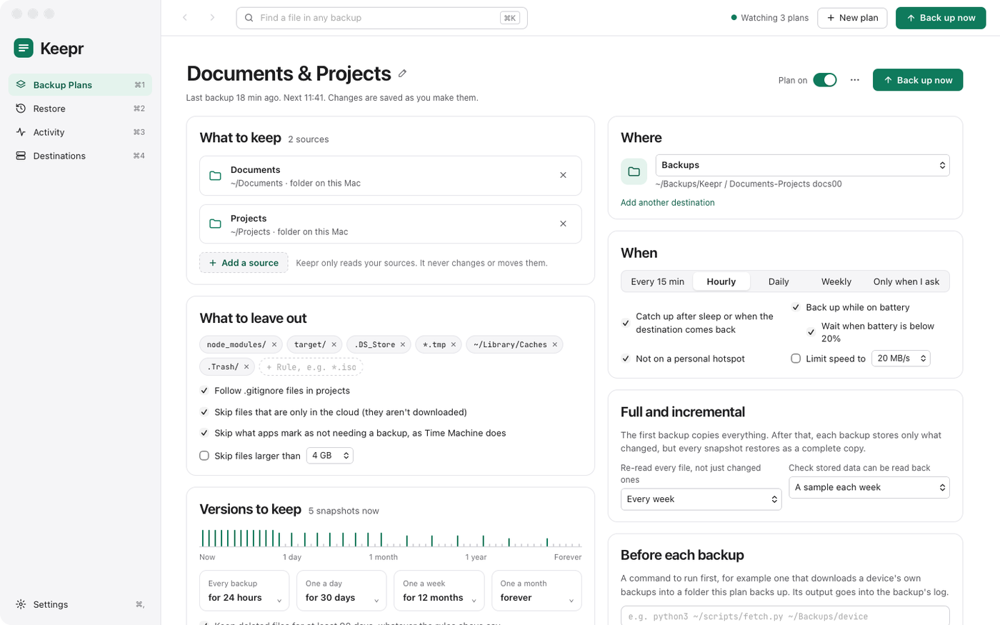

# Backup plans

A plan is a set of folders backed up to one destination, on a schedule, with rules for what to leave out and how long to keep versions. Make one with **Add a plan** (⌘N) on Backup Plans, or the green **+** in the sidebar; open one with **Edit…** on its card.

A new plan starts on: hourly, every backup kept for a day, then one a day for 30 days, one a week for 12 months and one a month forever, and encrypted. Change what you like, then click **Create and back up**. After that, changes to a plan are saved as you make them.

<a href="images/index.md#backup-plans"><picture><source media="(prefers-color-scheme: dark)" srcset="images/plan-dark.png"></picture></a>

[What to keep](#what-to-keep) · [What to leave out](#what-to-leave-out) · [Versions to keep](#versions-to-keep) · [Where](#where) · [When](#when) · [Full and incremental](#full-and-incremental) · [Before each backup](#before-each-backup) · [After each backup](#after-each-backup) · [Encryption](#encryption) · [Turning a plan off, and deleting it](#turning-a-plan-off-and-deleting-it)

## What to keep

**Add a source** adds what the plan backs up:

- **Folder or drive…** — any folders on this Mac or a connected drive. Pick several at once.
- **SMB share on the network…** — a folder on a NAS or another computer. Keepr lists the servers it finds; fill in the **User name**, **Password** and **Share** (**List** shows the shares), and **Folder in the share** (`/` for all of it). A login Finder or Keepr has already saved is filled in for you.
- **In iCloud Drive…**, **In OneDrive…** and so on — a folder in a cloud service synced to this Mac.
- **S3 bucket…** — a bucket at Amazon S3, Backblaze B2, Cloudflare R2 or another S3 service. Keepr can make a read-only key for it (see [Destinations](destinations.md#amazon-s3) for how the setup works), or you can enter one. **Check** tells you how much is in it. For Amazon, note that data leaving AWS costs about $0.09 a GB.

Keepr only reads your sources. It never changes or moves them. Each source can have its own name; click it to change it.

Removing a source that has been backed up asks what to do with it: **Keep its versions**, so you can still restore them, or **Delete its backed-up data…**, which takes it out of every snapshot.

## What to leave out

Rules leave files and folders out of the backup. A new plan leaves out `node_modules/`, `target/`, `.DS_Store`, `*.tmp`, `~/Library/Caches` and `.Trash/`, and the folders macOS keeps for itself on a drive: `.Spotlight-V100/`, `.fseventsd/`, `.Trashes/`, `.DocumentRevisions-V100/` and `.TemporaryItems/`. Type a rule in **+ Rule** and press Return to add one; click × on a rule to remove it.

| Rule | Leaves out |
|---|---|
| `name` or `*.iso` | Any file or folder with that name, or matching the pattern |
| `build/` | Any folder with that name, and everything in it |
| `~/Movies` or `/Volumes/Scratch` | That folder and everything in it |

- **Follow .gitignore files in projects** leaves out what a project's `.gitignore` does.
- **Skip files that are only in the cloud (they aren't downloaded)** leaves out files iCloud Drive, OneDrive and the like have removed from the Mac to save space. Untick it and Keepr downloads them to back them up, and they stay downloaded.
- **Skip what apps mark as not needing a backup, as Time Machine does** leaves out what apps have marked as not needing a backup, such as their caches and downloaded data they can fetch again. Time Machine skips the same things.
- **Skip files larger than** leaves out anything bigger than 1, 2, 4, 10 or 50 GB.

## Versions to keep

Every backup is a snapshot of all the plan's files as they were then. To keep the backup from growing for ever, older snapshots are thinned out, and the timeline shows what's left:

- **Every backup** — for 24 hours, 2 days or a week.
- **One a day** — for 7, 14, 30 or 90 days.
- **One a week** — for 4 weeks, 3, 6 or 12 months.
- **One a month** — for 1, 2 or 5 years, or forever.

Any of the first three can be **not kept**. The newest snapshot is always kept. **Keep deleted files for at least 90 days, whatever the rules above say** keeps the last copy of anything you've deleted in the last 90 days, even if the rules would have thinned it out.

Thinning out happens in a **Tidy up** after a backup, at most once a day. The space goes back only when nothing else uses the data: a file that hasn't changed is stored once, however many snapshots hold it.

## Where

**Where** is the [destination](destinations.md) the plan backs up to, and the folder in it that holds the backup, named after the plan. Once a plan has backed up, its destination is fixed: to keep a backup somewhere else as well, make another plan. If you rename a plan, Keepr offers to rename its folder to match.

**Add another destination** adds a destination without leaving the plan.

## When

- **Every 15 min**, **Hourly**, **Daily** or **Weekly** at a time you choose, or **Only when I ask**.
- **Catch up after sleep or when the destination comes back** runs a backup the Mac missed as soon as it can. Turned off, a missed backup is skipped and the plan waits for the next one.
- **Back up while on battery**. Turned off, a backup waits until the Mac is on mains power. Under it, **Wait when battery is below 20%** holds a backup back once the battery runs low.
- **Not on a personal hotspot** waits while the Mac is on a hotspot or another connection macOS marks as expensive.
- **Limit speed to** 5, 10, 20, 50 or 100 MB/s, for writing to the destination.

A backup that's due but can't run, because the drive is unplugged, say, waits and tries again every few minutes. It shows as **Waiting** on its card. These conditions hold back scheduled backups only: **Back up now** runs straight away.

## Full and incremental

The first backup copies everything. After that, each backup looks only at what changed, but every snapshot restores as a complete copy.

- **Re-read every file, not just changed ones** — every week, every month or never. A full backup reads every file again instead of trusting what changed, in case anything was missed. It still stores only what's new. **Back up everything now (full)** in the ⋯ menu runs one now.
- **Check stored data can be read back** — **A sample each week** reads back a twentieth of the stored data each week, **All of it each month** all of it, or never. A check that finds a problem always tells you. **Check a sample of the backup now** and **Check all of the backup now** in the ⋯ menu run one now.

## Before each backup

A command to run before each backup, for example one that exports a database into a folder the plan backs up. It runs in your login shell, its output goes into the backup's log in [Activity](day-to-day.md#activity), and it's stopped after 15 minutes. **If it fails**, Keepr either backs up anyway and marks the backup with a warning, or doesn't back up.

## After each backup

A command to run when each backup ends, however it went, for example one that tells a home server whether the backup worked. It runs in your login shell, its output goes into the backup's log, and it's stopped after 2 minutes. Whatever it does, the backup's own result stays as it was.

It's told how the backup went in environment variables:

| Variable | What it holds |
|---|---|
| `KEEPR_PLAN`, `KEEPR_PLAN_ID` | The plan's name and its id |
| `KEEPR_KIND` | `backup` or `full` |
| `KEEPR_RESULT` | `ok`, `warning`, `failed`, `waiting` (its destination wasn't there) or `cancelled` |
| `KEEPR_MESSAGE` | What the backup's result says, such as "3 changed · 15.8 KB sent" or why it failed |
| `KEEPR_STARTED`, `KEEPR_FINISHED` | When it started and finished |
| `KEEPR_LAST_SUCCESS` | When the plan last backed up successfully, or empty |
| `KEEPR_FILES`, `KEEPR_CHANGED`, `KEEPR_ADDED_BYTES` | How many files it looked at and how many had changed, and how much it added |
| `KEEPR_PLAN_IDS` | Every plan that's on, comma-separated, so whatever is listening can forget plans that are gone |

Times are like `2026-09-30T19:13:12+02:00`. While a plan keeps waiting for the same missing destination, the command runs only the first time.

## Encryption

An encrypted plan's files can only be read with its password or its recovery key: not by the destination, not by anyone who can open it. Encryption is chosen when you make a plan and can't be turned on or off afterwards. A new plan is encrypted unless you turn it off; choose a password of at least 8 characters. Keepr keeps it in your Keychain, so it doesn't ask again.

The first backup makes a **recovery key**, which works in place of the password. Keepr asks you to save it (**Save recovery key…**) and keeps asking until you click **I've saved it**. Put it somewhere safe away from the Mac, such as a password manager.

> Without the password or the recovery key, nobody can restore these files, including you.

**Change password…** needs the current password or the recovery key. The recovery key keeps working, and nothing in the backup is rewritten.

An unencrypted plan's files are compressed, but anyone who can open the destination can read them.

## Turning a plan off, and deleting it

**Plan on** turns a plan off: it won't back up until you turn it on again, and its backups stay as they are. The ⋯ menu has:

- **Delete plan…** — deletes the plan, and its password and recovery key from the Keychain. The backup itself stays at the destination.
- **Start a new backup…** — only for when a plan's backup has gone for good, a drive that died, say. It starts a new, empty backup in its place.
