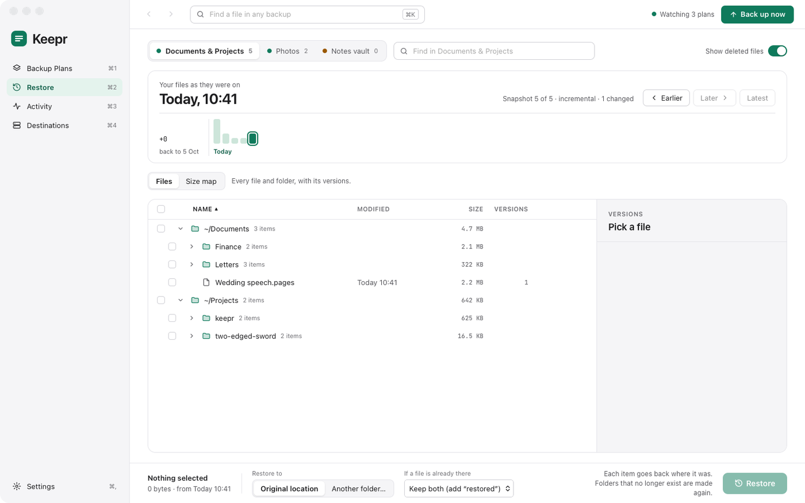
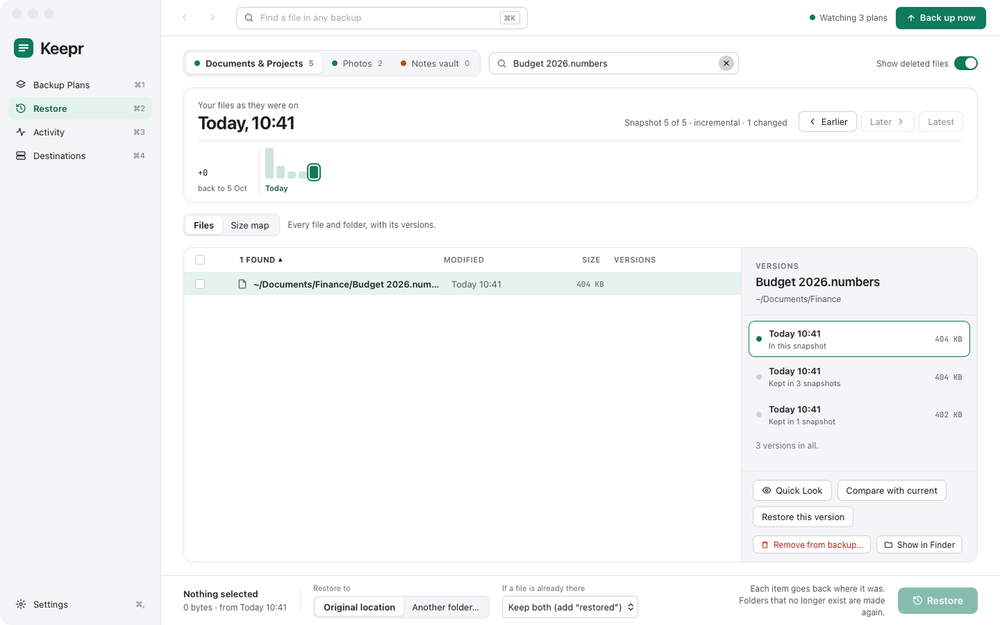
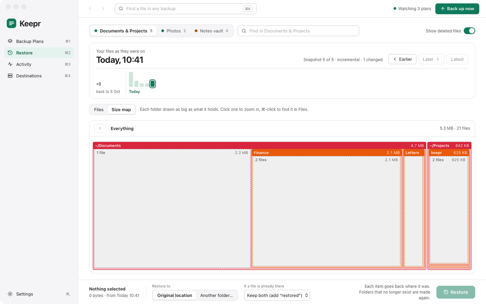
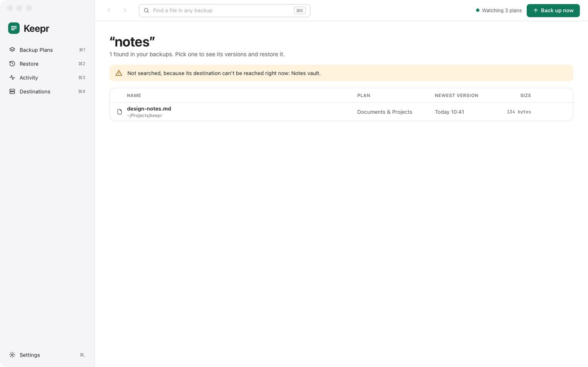

# Restore

Restore shows your files as they were at any backup, and puts back whichever you choose: one file, a folder, or everything. Open it from the sidebar (⌘2), **Restore…** on a plan's card, or **Restore a file…** in the menu bar.

<a href="images/index.md#restore"><picture><source media="(prefers-color-scheme: dark)" srcset="images/restore-dark.png"></picture></a>

[Going back to a moment](#going-back-to-a-moment) · [A file's versions](#a-files-versions) · [Restoring](#restoring) · [Seeing what takes the space](#seeing-what-takes-the-space) · [Finding a file in any backup](#finding-a-file-in-any-backup) · [Removing something from a backup](#removing-something-from-a-backup)

## Going back to a moment

The tabs along the top are your plans, each with the number of snapshots it has. Pick one, and it opens at its latest snapshot: "Your files as they were on…".

- **Earlier** and **Later**, or the ← and → keys, step through the snapshots; **Latest** goes back to the newest.
- The strip shows ten days at a time, one bar per snapshot, taller for more new data. Click a bar to go to that snapshot; the button at its left goes back to earlier days.
- **Find in** searches this snapshot by name.
- **Show deleted files** also lists files that were in an earlier snapshot but not this one, struck through.

The list shows each file's modified time and size, how many versions of it are kept, and whether it's **New**, **Changed** or **Deleted** in this snapshot. Click the arrow beside a folder, or double-click it, to open it.

At the latest snapshot, the list is also checked against your Mac as it is now, so you don't have to wait for the next backup to see what has changed since:

- **Not on Mac** — in the backup, but no longer on your Mac.
- **Not backed up** — on your Mac, but not in the backup yet. Files the plan leaves out on purpose (its [What to leave out](plans.md#what-to-leave-out) rules, and the like) never show this. One that's in no snapshot can't be chosen, as there's nothing to restore.

The list updates by itself when a backup, restore or removal of the plan finishes.

## A file's versions

Click a file to see every version the backup keeps of it, newest first, each with its date and size. The one in the snapshot you're looking at is marked **In this snapshot**.

<a href="images/index.md#restore"><picture><source media="(prefers-color-scheme: dark)" srcset="images/versions-dark.png"></picture></a>

- **Quick Look** opens the version in Quick Look, to see what's in it, without restoring it.
- **Compare with current** compares the version with the file on the Mac now. For a text file it shows the lines that differ: those only in the backup and those only on the Mac. For other files it says whether they're the same.
- **Restore this version** puts it back, as below.

Click a folder to see its size and how many items it held at that snapshot.

Under a file's versions, or a folder's size, **Show in Finder** opens the folder it's in on your Mac, with it selected; it's greyed out for something no longer on your Mac. **Remove from backup…** is beside it (see [Removing something from a backup](#removing-something-from-a-backup)).

Right-click a file or folder in the list for the same things in one place: **Quick Look** and **Compare with current** for a file in this snapshot, **Expand** or **Collapse** for a folder, **Restore** it on its own (to where the bar at the bottom says), **Select** or **Unselect** it, **Show in Finder**, **Copy path** and **Remove from backup…**. Right-click one of several ticked items to restore, unselect, copy the paths of or remove them all at once; what works on one item at a time (Quick Look, Compare with current, Expand, Show in Finder, and the buttons beside the versions) is greyed out for it.

## Restoring

Tick what you want back: files, folders, or a mix. A ticked folder comes back with everything in it as it was then, and what's inside it shows ticked too; untick one of those to leave just that out. A folder with only some of what's inside it ticked shows a dash. The box above the list ticks everything, or nothing. The bar at the bottom says how much you've selected, and:

- **Restore to** — **Original location**, where each item was, making any folders that no longer exist; or **Another folder…**, where items keep their folders inside the folder you choose.
- **If a file is already there** — **Keep both (add "restored")**, which names the restored copy "Budget (restored).numbers"; **Replace it**; or **Skip it**.

Then click **Restore**. Each file is written under a temporary name and only takes its real name once it's complete, so a restore that's stopped never leaves half a file. Files get back their modified times and permissions. A deleted file comes from the last snapshot that had it. After a restore to the original location, Keepr backs the plan up, so what you restored is in the latest snapshot and stops showing as deleted.

A restore runs like a backup, one job at a time, and shows in [Activity](day-to-day.md#activity). Files backed up from an S3 bucket can only be restored to a folder on the Mac, never back into the bucket.

## Seeing what takes the space

**Size map**, beside **Files** above the list, shows the snapshot as a map instead of a list. It draws each folder as a block as big as what it holds, nested inside the folder it's in and coloured by how deep it is, so what takes the space shows at a glance. The files directly in a folder are one dashed block, and folders too small to draw are another. Click a folder to zoom into it, and the path bar above the map to come back out. ⌘-click a folder, or click a dashed block, to find it in **Files**, open and picked, ready to see its versions or restore it.

To see every plan in one map, use **Size map** in the **Space used** card on [Backup Plans](features.md#backup-plans).

<a href="images/index.md#restore"><picture><source media="(prefers-color-scheme: dark)" srcset="images/sizemap-dark.png"></picture></a>

## Finding a file in any backup

Type a name in the toolbar's search box (⌘K) and press Return to search every plan and every snapshot at once. Each result shows its folder, its plan, its newest version and its size, and whether it has been deleted. Click one to open Restore at the newest snapshot that holds it, with the file picked and its versions showing.

<a href="images/index.md#restore"><picture><source media="(prefers-color-scheme: dark)" srcset="images/search-dark.png"></picture></a>

A plan whose destination can't be reached (an unplugged drive, say) isn't searched, and the results say so.

## Removing something from a backup

**Remove from backup…**, under a file's or folder's versions (a deleted one's too), takes it out of every snapshot, to free the space or because it should never have been backed up. Keepr asks twice first; it can't be undone. To stop it being backed up again, add a rule for it in the plan's [What to leave out](plans.md#what-to-leave-out).
